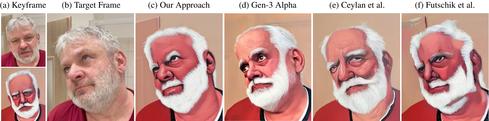

# StructuReiser: A Structure-preserving Video Stylization Method

[project page](https://dcgi.fel.cvut.cz/~sykorad/structureiser.html) | [paper](https://dcgi.fel.cvut.cz/~sykorad/Spetlik25-EGSR.pdf) | [video](https://www.youtube.com/watch?v=gbgJhk138W8)

This repository accompanies [a paper](https://dcgi.fel.cvut.cz/~sykorad/structureiser.html) accepted to EGSR 2025 (to appear in Computer Graphics Forum 44(4), 2025) by Radim Spetlik, David Futschik, and Daniel Sykora.



## Description

**TL;DR**: keyframe-driven video-to-video method with real-time inference that keeps your video's structure.

We introduce StructuReiser, a novel video-to-video translation method that transforms input videos into stylized sequences using a set of user-provided keyframes. Unlike most existing methods, StructuReiser strictly adheres to the structural elements of the target video, preserving the original identity while seamlessly applying the desired stylistic transformations. This provides a level of control and consistency that is challenging to achieve with text-driven or keyframe-based approaches, including large video models. Furthermore, StructuReiser supports real-time inference on standard graphics hardware as well as custom keyframe editing, enabling interactive applications and expanding possibilities for creative expression and video manipulation.

## Features

- **Structure preservation** – maintains the original content while applying style.
- **Keyframe driven** – stylize a sequence based on a few example frames.
- **Real-time inference** – runs interactively on commodity GPUs.
- **Editable** – modify keyframes to steer the style in specific regions.

## Installation Notes

This repository is designed to run on Linux systems with NVIDIA GPUs.

This installation guide assumes you have `Python 3.11` installed on your system with `Pipenv` package.

If you plan to use Singularity, you will also need `Singularity` (or Apptainer) installed on your system.

## Installation

First, modify appropriately paths in `config.sh` to point to correct directories.
Possibly the most important one is `SCRIPT_DIR`, which should point to the root of this repository.
Next, the `SINGULARITY_DIR` should point to the directory where you want to store the singularity container (if you want to build it).

This repository uses `pipenv` for dependency management. Install the required packages with:

```bash
pipenv install --dev
```

### Singularity environment
We recommend to use Singularity, build the container with:

```bash
bash singularity_build.sh
```

The resulting image will reside in `${SINGULARITY_DIR}/structureiser.sif`. The `slurm_job.sh` script detects this file automatically. When present it launches the job inside the container; otherwise it falls back to running the command inside your local `pipenv` environment.

Note that if you build the container as superuser, the `${HOME}` directory inside the container will be set to `/root`, which may not be what you want.

## Inference

Place your input frames in `${INPUT_DIR}` as specified in `config.sh` and run:

```bash
bash evaluate.sh
```

The stylized frames will appear in `${OUTPUT_DIR}`.


## Training

Edit the configuration in `confs/lili.yml` and launch training:

```bash
bash train.sh
```

Training runs through the provided `slurm_job.sh` wrapper.

Note that by default, the training uses `confs/lili.yml` as a configuration file, which uses patch-based regularization for keyframe loss. 
During our experiments, we found that, sometimes, a better approach is to use a full-frame keyframe loss.
Since a few training hyperparameters change, we’ve supplied a dedicated config file 
`confs/lili_full_frame.yml` that employs a full-frame keyframe loss in place of patch-based regularization 
rather than relying on a single switch.


### Provided sequence and checkpoint
This repository ships with the sample sequence and trained model for **Lili**, as shown in the paper. Both can be found under `data/Lili/` and are ready for evaluation.


## Pull Requests

If you find a bug or have a feature request, please open an issue or submit a pull request. Contributions are welcome!

### Weird error messages concerning python packages

If you encounter weird error messages concerning python packages, run the following command:
`pip list`
and create an issue with the output. I will try to fix it.


## Citation

If you use StructuReiser in your work, please cite our paper:

```bibtex
@article{spetlik2025structurereiser,
  title="{StructuReiser}: {A} Structure-preserving Video Stylization Method",
  author={Spetlik, Radim and Futschik, David and Sykora, Daniel},
  journal={Computer Graphics Forum},
  volume={44},
  number={4},
  year={2025},
}
```

